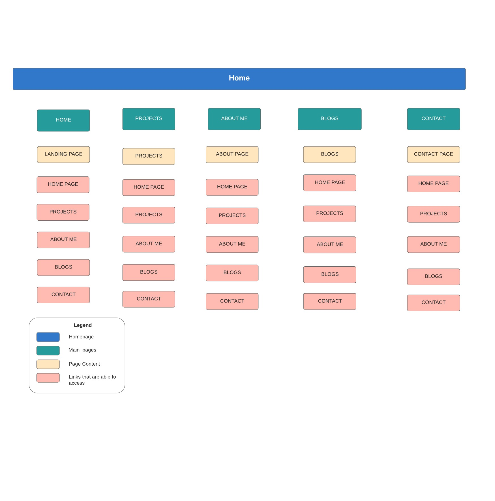
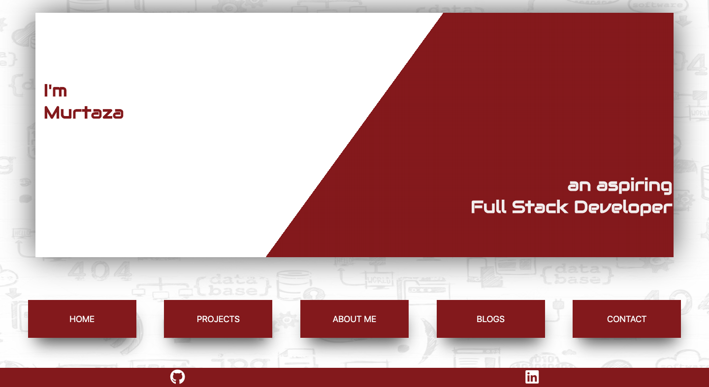
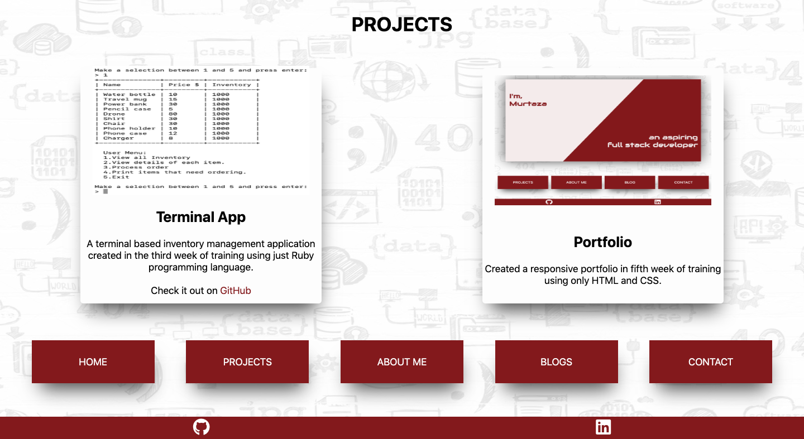
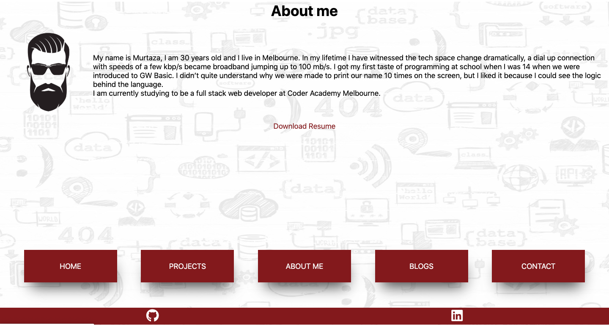
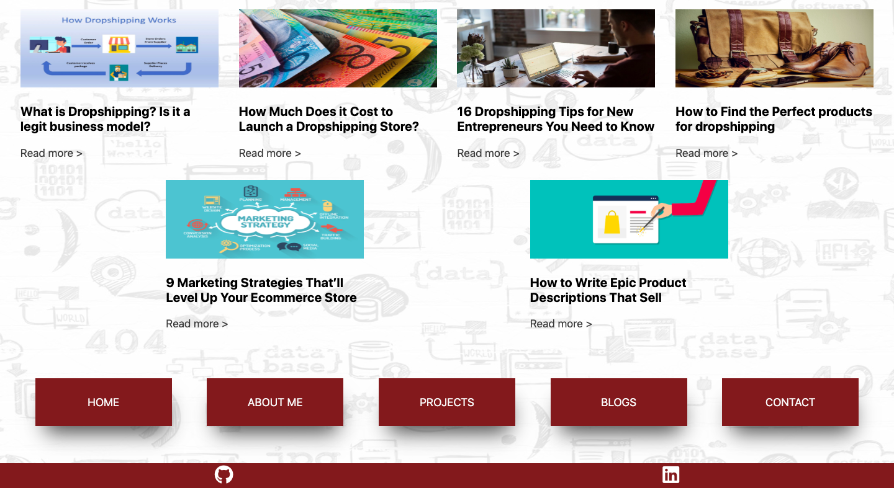
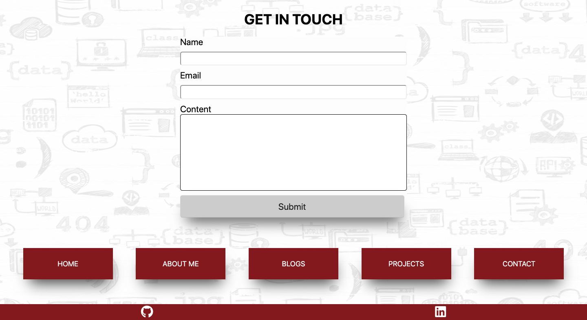
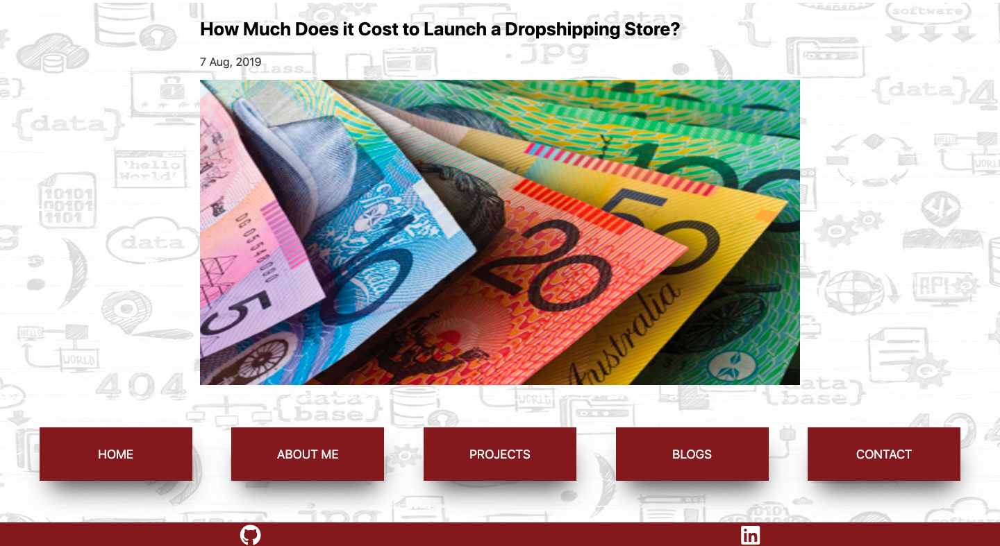

# PORTFOLIO WEBSITE

## (URL) TO THE WEBSITE:

## GITHUB REPSITORY LINK FOR THE WEBSITE:

## DESCRIPTION OF THE PORTFOLIO WEBSITE:

### PURPOSE
This portfolio website is created with the purpose of showcasing HTML and CSS skills to the prospective employer while leanrning the conventions of building a modern responsive website which would work on all different screen sizes.

### FEATURES
This portfolio website consists of multiple HTML pages styled by CSS and it includes the following features:
- Buttons
- Cards
- Social links
- HTML Form

### SITEMAP

### SCREENSHOTS

### TARGET AUDIENCE
The target audience for this portfoio website is a prospestive employer.

### TECH STACK
- HTML
- CSS
- Netfily for the deployment of website
- Figma for wireframes
- Lucid charts for sitemap
- Dribble for design ideas
